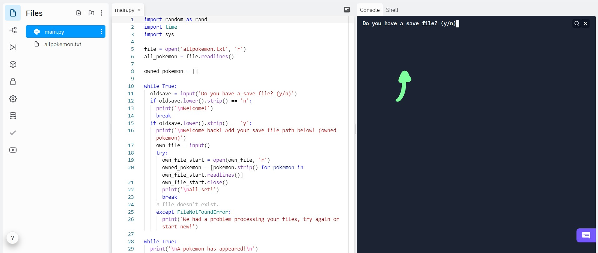
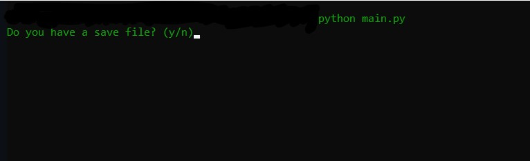

# Pokemon_Game
Hey! Thanks for visiting the source code.

[Hack Club Workshop](https://workshops.hackclub.com/python_pokedex)

All of the input/output is in the terminal.

## Repl.it

## Locally
After running the Python file. All of the prompts will be in the same window.

